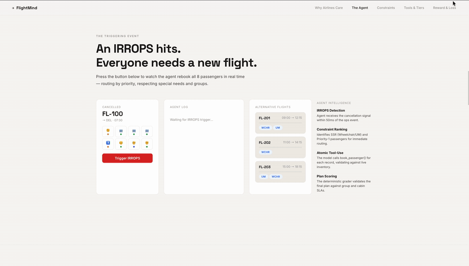
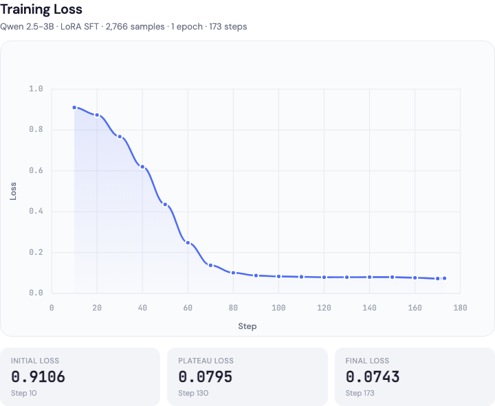

# ✈️ Airline Flight Rebooking — OpenEnv Environment

**Team Agentic Troop** · [HF Space](https://huggingface.co/spaces/Shreya1911/openenv-lfight-seat-env/tree/main)



An OpenEnv-compliant RL environment that simulates **airline flight rebooking after a flight cancellation** — a real operational task performed daily by airline operations centres. An agent must rebook all passengers from a cancelled flight onto alternative flights using 8 tool calls, respecting hard constraints (SSR compatibility, group integrity, connection deadlines), managing costs within a compensation budget, and treating loyalty members fairly across priority tiers.

---

## Motivation & Real-World Utility

Flight cancellations are a routine disruption in airline operations. When a flight is cancelled, operations agents must rebook every passenger onto alternative flights with different capacity, SSR support, and timing — while respecting cabin class, group integrity requirements, connection deadlines, loyalty entitlements, and budget constraints, all under time pressure. This environment models that exact task, making it directly useful for training and evaluating agents on constrained multi-step planning with heterogeneous passenger requirements, trade-off reasoning, and mid-episode adaptation to dynamic events.

---

## Environment Overview

Each episode begins with a set of passengers from a cancelled flight. The agent must rebook every passenger onto alternative flights using 8 tools. The episode ends when all passengers are booked, `finalize_plan` is called, or the step limit is reached.

### Action Space

The agent's action is a JSON object specifying one tool call per step:

| Tool | Arguments | Description |
|---|---|---|
| `list_passengers` | — | Survey all passengers with summary info (ID, tier, group, SSR/deadline flags, loyalty). |
| `get_passenger_details` | `passenger_id` | Full details for one passenger (cabin, SSR flags, deadline, loyalty, preferences). |
| `list_alternative_flights` | — | All active flights with per-cabin availability, times, and SSR support. |
| `get_flight_details` | `flight_id` | Details and current availability for one specific flight. |
| `book_passenger` | `passenger_id`, `flight_id`, `cabin` | Book one passenger onto a flight/cabin. Validates SSR, deadline, capacity. |
| `book_group` | `group_id`, `flight_id`, `cabin_assignments` | Book an entire group atomically onto one flight. |
| `unbook_passenger` | `passenger_id` | Remove an existing booking, freeing the seat. Useful after mid-episode events. |
| `finalize_plan` | — | End the episode and trigger final grading. |

**Action format:** `{"tool_name": "book_passenger", "args": {"passenger_id": "PAX-001", "flight_id": "FL-201", "cabin": "business"}}`

### Observation Space

After every `reset()` and `step()`, the agent receives a `FlightRebookingObservation` containing:

- **Counters** — `passengers_total`, `passengers_booked`, `passengers_remaining`.
- **Tool result** — structured output from the last tool call (success/error, cabin match, booking cost).
- **Step feedback** — `reward`, `reward_reason`, `step_count`, `max_steps`, `cumulative_reward`.
- **Booked summary** — current bookings: `[{passenger_id, flight_id, cabin}]`.
- **Flights snapshot** — current availability (populated after `list_alternative_flights` is called).
- **Reward breakdown** — per-component deltas (coverage, cabin match, group, deadline, SSR, cost, loyalty, opportunity cost).
- **Mid-episode events** — capacity changes, new passengers, SSR failures, deadline shifts, secondary cancellations.
- **Cost tracking** — `total_cost` incurred and `compensation_budget` remaining.

All models are typed Pydantic classes (`FlightRebookingAction`, `FlightRebookingObservation`, `FlightRebookingState`) inheriting from OpenEnv base types.

---

## Constraint Hierarchy

The agent must balance multiple constraint types in priority order:

1. **Hard constraints** (must not violate): SSR compatibility, hard group integrity, downstream deadlines.
2. **Coverage**: every passenger should be rebooked.
3. **Cost efficiency**: stay within the compensation budget; avoid unnecessary upgrades.
4. **Loyalty compliance**: protect gold/silver members from downgrades.
5. **Cabin matching**: place passengers in their original cabin class.
6. **Priority tiers**: tier 1 (highest) passengers get better outcomes in trade-offs.
7. **Soft group integrity**: keep soft groups together when possible.

---

## Task Difficulty Design

The environment provides **3 static tasks (easy, medium, hard)** plus **procedural generation** via seed for unlimited episodes. Difficulty is driven entirely by the underlying data — the number of passengers, constraint density, capacity scarcity, and adversarial patterns — not by varying the prompt.

### Easy

| Attribute | Value |
|---|---|
| Passengers | 8 |
| Max steps | 20 |
| Compensation budget | $5,000 |
| Constraints | Low: few SSR flags, no hard groups, relaxed deadlines |
| Mid-episode events | Disabled |

### Medium

| Attribute | Value |
|---|---|
| Passengers | 15 |
| Max steps | 35 |
| Compensation budget | $4,000 |
| Constraints | Moderate: SSR requirements, groups, deadlines, loyalty tiers |
| Mid-episode events | Disabled |

### Hard

| Attribute | Value |
|---|---|
| Passengers | 25 |
| Max steps | 55 |
| Compensation budget | $5,000 |
| Constraints | High: dense SSRs, hard groups, tight deadlines, capacity scarcity |
| Mid-episode events | Disabled (enabled in procedural mode) |

### Procedural Generation

For training at scale, pass a `seed` to `reset()` to generate unlimited unique episodes with configurable difficulty (0.0–1.0). At higher difficulty, the generator injects adversarial patterns:

- **Greedy traps** — the "obvious" best flight has scarce seats for critical passengers.
- **Distractor flights** — high-capacity flights with no SSR support.
- **Priority inversion** — low-tier passengers with rare SSR requirements.
- **Pareto conflicts** — no assignment simultaneously satisfies all constraints.
- **Mid-episode events** — capacity changes, new passengers, SSR failures, deadline shifts, secondary cancellations.

---

## Reward Design

The reward function provides **per-step shaping signal** with progressive difficulty scaling:

| Event | Reward | Notes |
|---|---|---|
| Booking: same cabin | +0.30 × priority weight | Best per-booking outcome |
| Booking: cabin upgrade | +0.10 × priority weight | Acceptable but costs money |
| Booking: cabin downgrade | −0.02 × priority weight | Least desirable |
| Booking: deadline met bonus | +0.05 × priority weight | Connection preserved |
| Hard group violation | −0.30 | Booking individual from a hard group |
| Failed booking | −0.50 | Invalid action (no seats, SSR mismatch, etc.) |
| Group booking (same cabin) | Sum of per-member rewards | Atomic group placement |
| Unbook passenger | −0.05 | Disruption cost (partially offset if event-driven) |
| Invalid tool | −0.20 | Unrecognized tool name |
| Repeated identical call (>2x) | −0.05 | Penalizes stuck loops |

**Decomposed reward breakdown** is returned per step with component deltas: `coverage_delta`, `cabin_match_delta`, `group_delta`, `deadline_delta`, `ssr_delta`, `cost_delta`, `loyalty_delta`, `opportunity_cost`.

**Opportunity cost signaling**: when a booking consumes the last seat on an SSR-compatible flight that other constrained passengers need, a penalty is applied and explained.

---

## Grader

Each task has a deterministic grader producing a score in **[0.0, 1.0]** from 7 weighted components:

| Component | Weight | Description |
|---|---|---|
| Coverage | 0.25 | Fraction of passengers booked |
| Cabin match | 0.15 | Priority-weighted cabin correctness |
| Group integrity | 0.12 | Groups kept together on same flight |
| Deadline compliance | 0.13 | Priority-weighted deadline satisfaction |
| SSR integrity | 0.15 | No SSR violations (hard constraint) |
| Cost efficiency | 0.10 | Budget adherence + per-passenger cost |
| Loyalty compliance | 0.10 | Gold/silver members not downgraded |

**Hard-constraint penalty**: each SSR violation or hard group split subtracts 0.15 from the final score.

The grader is deterministic and reproducible — given the same booking state, it always returns the same score.

---

## Training Pipeline

The repository includes a complete **SFT + GRPO training pipeline** for fine-tuning a language model (Qwen2.5) to solve the rebooking task:

### Phase 1: Supervised Fine-Tuning (SFT)

1. **Expert policy** (`training/expert_policy.py`) — a greedy-optimal solver that generates expert trajectories with chain-of-thought reasoning explaining each decision.
2. **Data collection** (`training/collect_sft_data.py`) — runs the expert across thousands of procedurally generated episodes at 7 difficulty levels, collecting trajectories as JSON.
3. **Dataset building** (`training/build_sft_dataset.py`) — converts episode JSONs into a HuggingFace Dataset in plain-text format with role delimiters.
4. **SFT training** (`training/train_sft.py`) — fine-tunes Qwen2.5 with LoRA using TRL's `SFTTrainer`.

```bash
# Collect expert trajectories
python -m training.collect_sft_data --n_episodes 3000

# Build HF dataset
python -m training.build_sft_dataset --episodes_dir data/sft_episodes --min_score 0.7

# Train
python -m training.train_sft --config training/configs/sft_config.yaml
```

**Training result** — loss drops from **0.9106 → 0.0743** (92% reduction) over 173 steps on 2,766 samples:



### Phase 2: GRPO (Group Relative Policy Optimization)

Reinforces the SFT-trained model against the live environment using the grader score as reward, teaching trade-off reasoning that static demonstrations cannot capture.

1. **Prompt dataset** (`training/build_grpo_prompts.py`) — generates initial prompts for GRPO training across varied difficulties.
2. **Environment wrapper** (`training/grpo_env.py`) — TRL-compatible environment with typed tool methods and Google-style docstrings for automatic schema extraction.
3. **GRPO training** (`training/train_grpo.py`) — trains with dual reward functions (grader score + step efficiency).

```bash
# Build GRPO prompts
python -m training.build_grpo_prompts --n_prompts 5000

# Train
python -m training.train_grpo --config training/configs/grpo_config.yaml
```

### Evaluation

```bash
# Evaluate expert policy
python -m training.eval --expert --n_episodes 50

# Evaluate a trained model
python -m training.eval --model checkpoints/grpo/final --procedural --n_episodes 50

# Compare base vs SFT vs GRPO
python -m training.eval --model Qwen/Qwen2.5-7B-Instruct --compare checkpoints/sft/final checkpoints/grpo/final
```

---

## Setup & Usage

### Prerequisites

- Python 3.10+
- [uv](https://github.com/astral-sh/uv) (recommended for dependency management)
- Docker (for containerised execution)

### Install Dependencies

```bash
# Core dependencies
uv sync

# With training dependencies
uv sync --extra train

# With dev dependencies (testing)
uv sync --extra dev
```

### 1. Start the Environment Server

```bash
uv run server
```

The server starts at `http://localhost:8000` with the OpenEnv-compliant API (`reset()`, `step()`, `state()` endpoints).

### 2. Run Baseline Inference

Set the required environment variables and run:

```bash
export API_BASE_URL="https://router.huggingface.co/v1"
export MODEL_NAME="Qwen/Qwen2.5-7B-Instruct"
export HF_TOKEN="your_hf_token_here"

python inference.py
```

The script uses the **OpenAI client** to call the LLM, runs all 3 tasks (easy, medium, hard), and outputs grader scores. Results are saved to the `results/` directory.

### 3. Docker

```bash
docker build -t flight-rebooking .
docker run -p 8000:8000 flight-rebooking
```

---

## Project Structure

```
├── inference.py              # Baseline inference script (OpenAI client, all 3 tasks)
├── models.py                 # Typed Pydantic models (Action, Observation, State)
├── client.py                 # OpenEnv WebSocket client for the environment
├── openenv.yaml              # OpenEnv spec metadata
├── Dockerfile                # Containerised deployment
├── pyproject.toml            # Dependencies and package config
├── server/
│   ├── app.py                # FastAPI application
│   ├── environment.py        # Core environment logic (reset, step, state, events)
│   ├── tools.py              # 8 tool implementations with validation chains
│   └── rewards.py            # 3-layer reward system + 7-component grader
├── data/
│   ├── generate.py           # Procedural episode generator (adversarial + Pareto conflicts)
│   ├── easy/                 # 8 passengers, low constraint density
│   ├── medium/               # 15 passengers, moderate constraints
│   └── hard/                 # 25 passengers, high constraints + scarcity
├── training/
│   ├── expert_policy.py      # Greedy-optimal solver with chain-of-thought reasoning
│   ├── collect_sft_data.py   # Expert trajectory collection across difficulty levels
│   ├── build_sft_dataset.py  # Convert episodes to HF Dataset for SFTTrainer
│   ├── train_sft.py          # SFT training script (LoRA + TRL)
│   ├── build_grpo_prompts.py # GRPO prompt dataset builder
│   ├── grpo_env.py           # TRL-compatible environment wrapper for GRPO
│   ├── train_grpo.py         # GRPO training script (dual reward functions)
│   ├── eval.py               # Evaluation across tiers with comparison support
│   ├── grpo_prompts/         # Pre-built GRPO prompt dataset
│   └── configs/
│       ├── sft_config.yaml   # SFT hyperparameters
│       └── grpo_config.yaml  # GRPO hyperparameters
├── tests/
│   ├── test_environment.py   # Integration tests for all 3 tasks
│   └── test_rewards.py       # Unit tests for reward and grader logic
└── validate-submission.sh    # Submission validation script
```

---

## OpenEnv Spec Compliance

- **Typed models:** `FlightRebookingAction`, `FlightRebookingObservation`, `FlightRebookingState` — all Pydantic classes extending OpenEnv base types.
- **Endpoints:** `step(action)`, `reset(task_id)`, `state()` — fully implemented.
- **`openenv.yaml`:** Present with spec version, runtime, and port configuration.
- **Graders:** 3 tasks with deterministic graders returning scores in [0.0, 1.0].
- **Dockerfile:** Builds and runs cleanly.
- **HF Space:** Deployed and responding at [HF Space](https://huggingface.co/spaces/Shreya1911/openenv-lfight-seat-env/tree/main)
